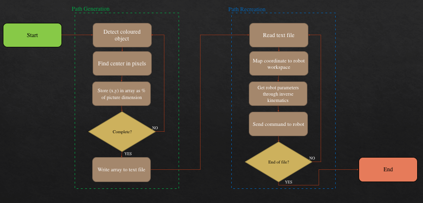
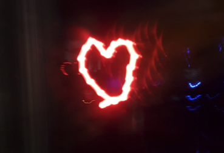
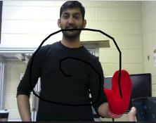
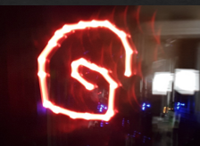
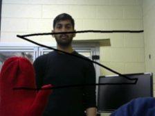
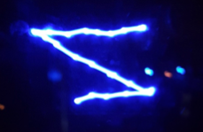

# Light Painting with a FANUC 200iD Robot

This project turns hand-drawn or camera-tracked paths into robot motion so a FANUC 200iD arm can recreate the path with a light source during long-exposure photography.

The system combines two environments:

1. A PC vision pipeline captures or processes an image path and writes waypoint data.
2. A FANUC controller reads those waypoints and moves the robot end effector through the path.

## Project Goals

- Capture a desired drawing path from image processing or live color tracking.
- Convert the path into waypoints that can be consumed by the robot control program.
- Use inverse kinematics and FANUC numeric registers to move the robot through the path.
- Produce recognizable long-exposure light paintings.

## Results

### Image Processing

### Robot Waypoint Tracking

### Final Light Painting

## Gallery

### Heart

### Spiral

### Z

## Repository Layout

- `ComputerVision/` contains OpenCV experiments for color tracking, edge detection, contour detection, circle detection, and waypoint generation.
- `ArmMovement/` contains the VB.NET Fanuc register-control program and inverse kinematics logic.
- `img/` contains process diagrams, demos, and final light-painting results.

## Notes For Future Development

- The computer vision code was built around OpenCV and includes both CMake and Visual Studio project artifacts.
- The arm movement code depends on FANUC FRRobot COM libraries and FANUC 200iD robot/controller hardware access.
